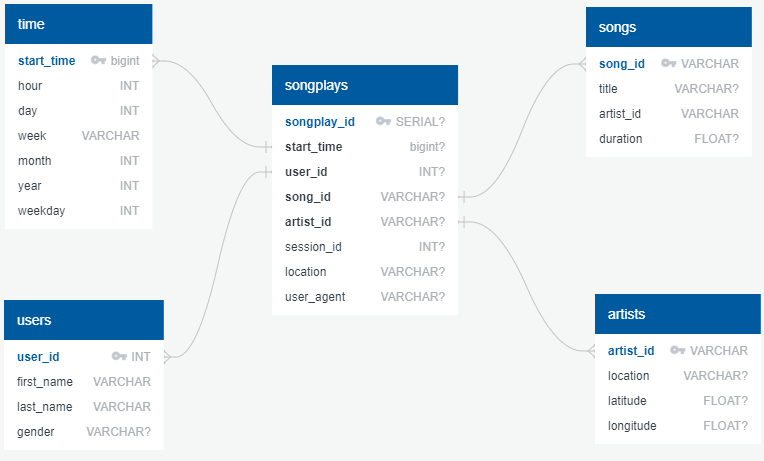

# Project: Data Modeling with Postgres

## Introduction
A startup called Sparkify wants to analyze the data they've been collecting on songs and user activity on their new music streaming app. The analytics team is particularly interested in understanding what songs users are listening to. Currently, they don't have an easy way to query their data, which resides in a directory of JSON logs on user activity on the app, as well as a directory with JSON metadata on the songs in their app.

In this project, Sparkify database was created and ETL processes were developed to meet the above-mentioned needs.

## Schema Design
Considering the needs, scheme structure preferred as star schema design. 

In this context, songplays, which is a table where song movements are kept, was created as a fact table. To provide detailed information to support this fact table, a user table, song table, artist table and time table were created as a dimension table.

The scheme design is as follows:
  > 

## ETL Pipeline
Scripts were created and added to the sql_queries.py file to provide the above schema structure, to create table, insert data and delete table.
By using the queries in this file in the crate_table.py file, it is possible to create a database and tables. For this, create_table.py file must be run before ETL processes. 
After the tables are created, the database will be ready for data entry. 

In this project, the data is located in the data folder in the main directory. There are song and user movement logs.

As seen in the sample song data below; song data provides information for songs and artists tables. The flow process_song_file has been developed for this in the etl.py file.

  > {"num_songs": 1, "artist_id": "ARJIE2Y1187B994AB7", "artist_latitude": null, "artist_longitude": null, "artist_location": "", "artist_name": "Line Renaud", "song_id": "SOUPIRU12A6D4FA1E1", "title": "Der Kleine Dompfaff", "duration": 152.92036, "year": 0}

As seen in the sample user log data below; log data provides information for time, user and songplays tables. The flow process_log_file has been developed for this in the etl.py file. In addition, only NextPage log data are transferred to tables.
  > {"artist":null,"auth":"Logged In","firstName":"Walter","gender":"M","itemInSession":0,"lastName":"Frye","length":null,"level":"free","location":"San Francisco-Oakland-Hayward, CA","method":"GET","page":"Home","registration":1540919166796.0,"sessionId":38,"song":null,"status":200,"ts":1541105830796,"userAgent":"\"Mozilla\/5.0 (Macintosh; Intel Mac OS X 10_9_4) AppleWebKit\/537.36 (KHTML, like Gecko) Chrome\/36.0.1985.143 Safari\/537.36\"","userId":"39"}

In these ETL processes, necessary column mappings and filtering are made and transfers to the table are provided. 

# Project Template
To get started with the project, you can find files at repository's dev branch. You can clone or download the project template files from the repository, if you'd like to develop your project locally.

In addition to the data files, the project workspace includes six files:
  * `test.ipynb` displays the first few rows of each table to let you check your database. You can use for Jupyter env.
  * `create_tables.py` drops and creates your tables. You run this file to reset your tables before each time you run your ETL scripts.
  * `etl.ipynb` reads and processes a single file from song_data and log_data and loads the data into your tables. This notebook contains detailed instructions on the ETL process for each of the tables. You can use for Jupyter env.
  * `etl.py` reads and processes files from song_data and log_data and loads them into your tables. You can fill this out based on your work in the ETL notebook.
  * `sql_queries.py` contains all your sql queries, and is imported into the last three files above.
  * `README.md` provides discussion on your project.

## Requirements
In order for the project to run smoothly, the libraries in requirements.txt must be installed with the following command.
  > pip install -r requirements.txt
  
## Project Running
* Firstly, you must run create tables:
  > python create_tables.py

* If you didn't get any error, you can start etl process:
  > python etl.py

After, all these steps, you complete first ETL process. If you want to continuosly or scheduled running this ETL process, you can use Cron Job or Airflow methods. 

**NOTE: You will not be able to run test.ipynb, etl.ipynb, or etl.py until you have run create_tables.py at least once to create the sparkifydb database, which these other files connect to.**

### Cron Job:
https://en.wikipedia.org/wiki/Cron

### Airflow Scheduling:
https://airflow.apache.org/docs/1.10.1/scheduler.html#:~:text=The%20Airflow%20scheduler%20monitors%20all,whether%20they%20can%20be%20triggered.
https://airflow.apache.org/docs/stable/scheduler.html

 

